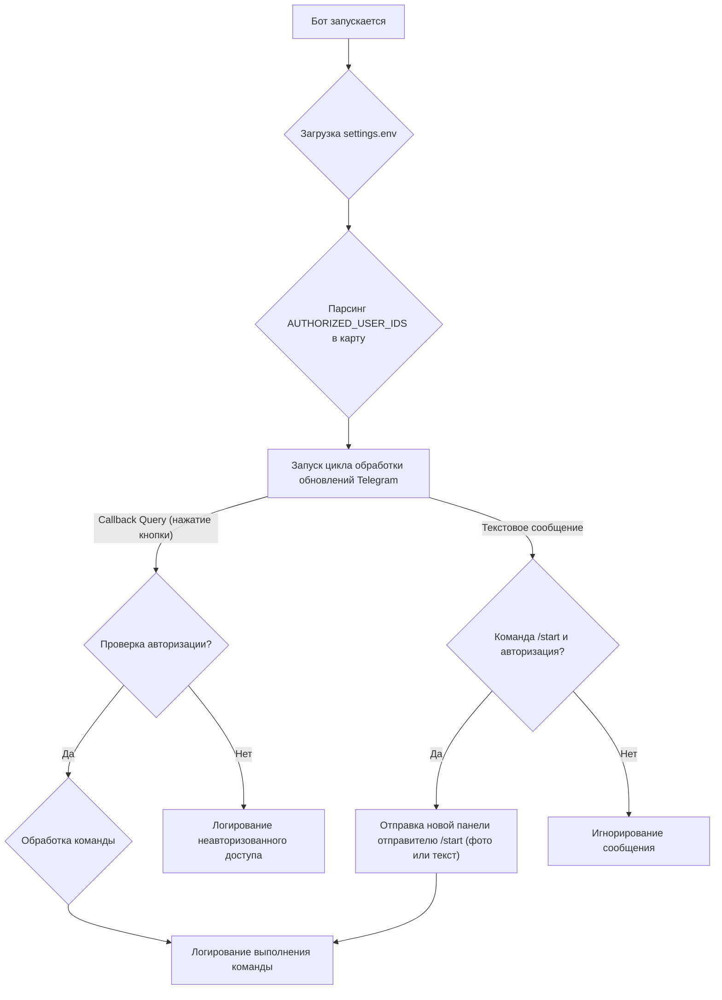

URL репозитория: "https://github.com/DiscipulusVitae/tbot-controls-pc"
Текущий момент разработки можно понять прочитав `docs/project-state.md`. Файл содержит историю действий агентов каждого этапа. (Я создаю отдельный чат для каждого этапа)

### **План разработки `tbot-controls-pc`**

---

#### **Воркфлоу для каждого этапа:**

В каждой сессии агент реализует только один этап и ничего больше. После реализации кода, агент даёт инструкции для тестирования и останавливается. Мы тестируем и дорабатываем, если потребуется. Когда я подтвержу, что фича готова, агент дополняет `project-state.md`. Затем делается комит и пуш.

---

#### **Этап 1: Основа и каркас приложения (`feat: Foundation`)**

1.  **Инициализация проекта:**
    *   Создать Go-модуль командой `go mod init tbot-controls-pc`.
2.  **Установка зависимостей:**
    *   Добавить библиотеки: `go get github.com/go-telegram-bot-api/telegram-bot-api/v5` и `go get github.com/joho/godotenv`.
3.  **Настройка логирования:**
    *   Реализовать функцию для настройки стандартного логгера (`log` package).
    *   Логи должны автоматически записываться в файл `tbot-controls-pc.log`, который будет создаваться в той же директории, что и исполняемый файл.
4.  **Конфигурация:**
    *   Написать код для чтения токена `TELEGRAM_BOT_TOKEN` из файла `settings.env`.
    *   Добавить поддержку переменной `TELEGRAM_USER_ID` для авторизации пользователей.
5.  **Ядро бота:**
    *   Инициализировать подключение к Telegram Bot API.
    *   Запустить основной цикл для получения и обработки обновлений от Telegram (`getUpdatesChan`).
6.  **Пользовательский интерфейс:**
    *   Создать и отправить пользователю при старте `InlineKeyboardMarkup` с кнопками: "💤", "⏯️", "🔉", "🔊".
    *   Настроить базовый обработчик `callback_query`, который на этом этапе будет только логировать нажатия кнопок без выполнения действий.

---

#### **Этап 2: Реализация функции Play/Pause (`feat: ⏯️`)**

1.  **Интеграция с Windows API:**
    *   Создать отдельный файл `winapi.go` для взаимодействия с `user32.dll`.
    *   Реализовать в нем функцию `SendMediaKey(keyCode uintptr)`, которая эмулирует нажатие мультимедийной клавиши через `keybd_event`.
2.  **Обработка команды:**
    *   В `main.go` добавить в обработчик `callback_query` логику для кнопки "⏯️".
    *   При нажатии вызывать `winapi.SendMediaKey` с кодом `VK_MEDIA_PLAY_PAUSE`.
3.  **Логирование:**
    *   Добавить запись в лог об успешном выполнении действия.

---

#### **Этап 3: Реализация функции гибернации (`feat: 💤`)**

1.  **Системные команды:**
    *   Создать функцию `HibernatePC()`, которая будет выполнять системную команду `rundll32.exe powrprof.dll,SetSuspendState 0,1,0` с помощью пакета `os/exec`.
2.  **Обработка команды:**
    *   В `main.go` добавить в обработчик `callback_query` логику для кнопки "💤".
    *   При нажатии вызывать `HibernatePC()`.
3.  **Логирование:**
    *   Добавить запись в лог о команде на гибернацию.

---

#### **Этап 4: Реализация управления громкостью и финализация (`feat: 🔊 Volume Control`)**

1.  **Обработка команд громкости:**
    *   В `main.go` добавить в обработчик `callback_query` логику для кнопок "🔉" и "🔊".
    *   При нажатии вызывать ранее созданную функцию `winapi.SendMediaKey` с кодами `VK_VOLUME_DOWN` и `VK_VOLUME_UP` соответственно.
2.  **Логирование:**
    *   Добавить логирование изменения громкости.
3.  **Финальная сборка:**
    *   Подготовить инструкцию по сборке исполняемого файла для фонового режима (без окна консоли) с помощью команды: `go build -ldflags "-H=windowsgui" .`
4.  **Документация:**
    *   Составить краткое руководство по запуску:
        1.  Поместить `tbot-controls-pc.exe` в любую папку.
        2.  Рядом создать файл `settings.env`.
        3.  В `settings.env` добавить строки:
            *   `TELEGRAM_BOT_TOKEN=ВАШ_ТОКЕН`
            *   `TELEGRAM_USER_ID=ВАШ_ID_ПОЛЬЗОВАТЕЛЯ`
        4.  Запустить `tbot-controls-pc.exe`.

---

#### **Release v1.0.0**

1.  **Создание README.md:**
    *   Описание функциональности бота
    *   Инструкции по установке и настройке
    *   Требования к системе
    *   Примеры использования
2.  **Инструкция по настройке автозагрузки:**
    *   Создание задачи в Планировщике Windows для запуска при входе в систему
    *   Настройки: запуск с правами пользователя, скрытый режим
    *   Пошаговое руководство с скриншотами
3.  **Подготовка к релизу:**
    *   Финальный коммит с сообщением "Release v1.0.0"
    *   Создание и пуш тэга `git tag v1.0.0 && git push origin v1.0.0`
4.  **Обновление документации:**
    *   Обновление `project-state.md` с информацией о финализации
    *   Создание CHANGELOG.md с описанием изменений

---

#### **Аватарка в середине пространства (`feat: Аватарка`)**

1.  **Интеграция аватара:**
    *   Проверка наличия файла `tbot-picture.jpg` в корне проекта.
    *   Модификация функции `sendInitialMessage` для отправки `tbot-picture.jpg` как фотографии с подписью "Панель управления ПК" и прикрепленной клавиатурой. Предусмотреть откат к текстовому сообщению в случае отсутствия файла или ошибки отправки фото.
    *   Переименование функции `sendTextMessage` в `sendOrEditMessage` и ее адаптация для отправки новых или редактирования существующих текстовых сообщений.
    *   Обновление логики в `main` функции для обработки обновления существующих панелей: определение типа сообщения (фото/текст) и соответствующее обновление `ReplyMarkup` или переотправка панели в случае неудачи.
2.  **Логирование:**
    *   Улучшение логирования для отображения статуса отправки/редактирования фото/текстовых сообщений.

---

#### **Доступ для нескольких пользователей (`feat: Multi-User Access`)**

Этот этап позволит нескольким авторизованным пользователям использовать бота для управления ПК. Теперь все пользователи будут инициировать получение панели управления командой `/start`, обеспечивая единообразный пользовательский опыт и упрощая логику бота.

##### **Диаграмма процесса работы бота с несколькими пользователями:**

##### **План реализации:**

*   **Обновить `settings.env`**:
    *   [ ] Удалить переменную `TELEGRAM_USER_ID`.
    *   [ ] Добавить новую переменную `TELEGRAM_AUTHORIZED_USER_IDS` (список ID через запятую).

*   **Изменить `main.go`**:
    *   [ ] Удалить структуру `PanelState` и все функции (`loadPanelState`, `savePanelState`) и вызовы, связанные с `panel-state.json`.
    *   [ ] Удалить логику автоматической отправки/обновления панели при старте бота.
    *   [ ] Реализовать загрузку `TELEGRAM_AUTHORIZED_USER_IDS` из `settings.env`.
    *   [ ] Реализовать парсинг `TELEGRAM_AUTHORIZED_USER_IDS` в `map[int64]bool` для быстрого поиска.
    *   [ ] Обновить проверку авторизации в обработчиках `callback_query` и `message` с использованием `authorizedUsersMap`.
    *   [ ] Адаптировать функцию `sendInitialMessage` (переименовать в `sendPanelToUser` или аналогично), чтобы она всегда отправляла новую панель (фото или текст) указанному `userID`, без попыток редактирования или сохранения состояния. Удалить функцию `sendOrEditMessage`.
    *   [ ] Реализовать обработку текстовых сообщений: при получении команды `/start` от авторизованного пользователя, вызывать адаптированную функцию `sendPanelToUser` для отправки ему новой панели управления.

---